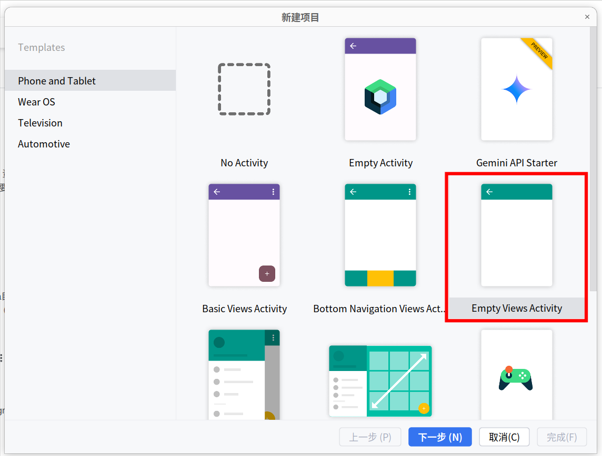
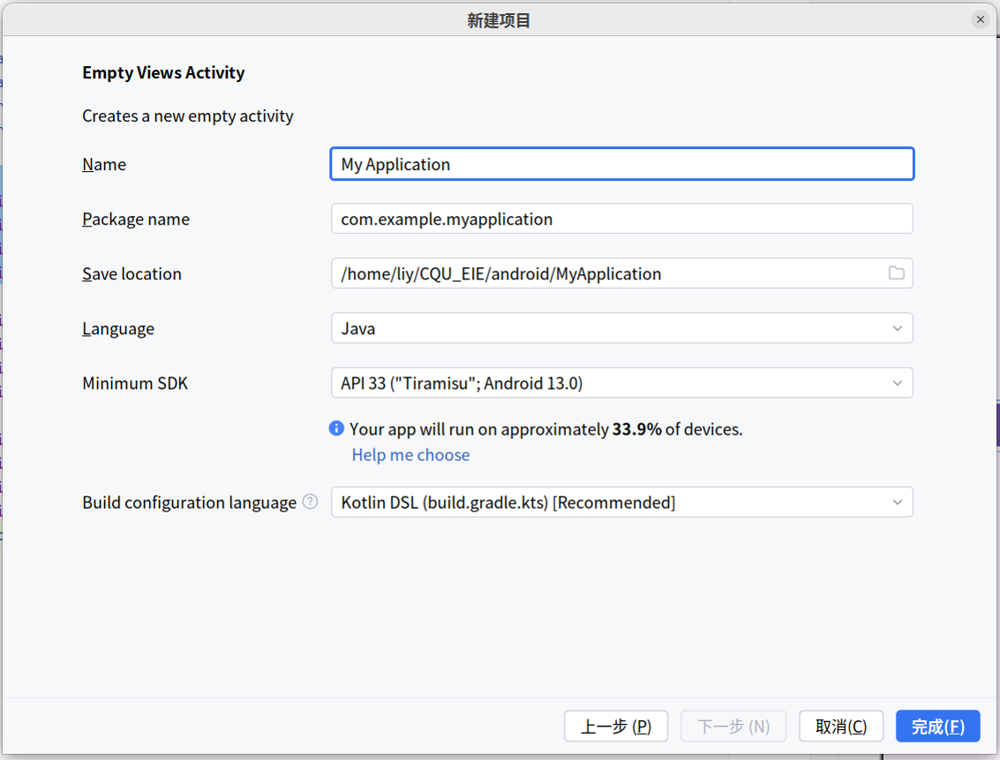

    
    <h1>
        国家（重庆）卓越工程师学院 2021级 智能网联汽车方向
    </h1>

- 必修 1: [车载软件开发基础](./autoSoftDev/)

- 必修 2: [智能驾驶算法基础](./smartDriveAlgo/)

- 选修 1: [智能网联汽车数据工程](./dataEngineer/)

- 选修 2: [智能座舱与人机交互](./android/), <a href="#android">文档</a>

- 毕业论文: [暂无](www.leeyearn.com)

 
 
 
 
 
 

  
  <h1>
    智能座舱与人机交互 - Android 开发
  </h1>

- 前情学习 1： [基本项目结构梳理](#基本项目结构梳理)

- 前请学习 2： [页面跳转](./PageSwitching/)

- 课程任务 1： [计算器](./Calculator/)

<h2 id="基本项目结构梳理">基本项目结构梳理</h2>

### 1. 软件版本

- `Android studio` 
  - Android Studio Koala Feature Drop | 2024.1.2
  - Build #AI-241.18034.62.2412.12266719, built on August 23, 2024
  - Runtime version: 17.0.11+0-17.0.11b1207.24-11852314 amd64
  - VM: OpenJDK 64-Bit Server VM by JetBrains s.r.o.
  - Linux 6.8.0-48-generic
  - GC: G1 Young Generation, G1 Old Generation
  - Memory: 2048M
  - Cores: 20
  - Registry:
    - ide.experimental.ui=true
  - Non-Bundled Plugins:
      - com.intellij.zh (241.190)
      - com.github.copilot (1.5.28.7313)
  - Current Desktop: ubuntu:GNOME

### 2. 创建基本项目

- 一般选择 `Empty Views Activity`
  

- 进入具体设置后
  

  - `Name` 项目名称
  - `Package name` 默认即可
  - `Save lacation` 保存地点
  - `Language` 使用语言
  - `Minimum SDK` 最低SDK
  - `Build configuration language` 构建配置语言

### 3. 项目结构
| Root Directory    | 作用
|:------------------|:--------------------------------------------------|
| .gradle           | android studio自动生成的目录，一般情况不做修改
| .idea             | android studio自动生成的目录，一般情况不做修改
| app               | [module模块](#app)
| gradle            | gradle环境支持文件夹
| .gitignore        | git源码管理文件, 都是写不上传的文件
| build.gradle      | gradle项目自动编译的配置文件
| gradlew           | 自动完成gradle环境的linux mac脚本, 配合gradle文件夹使用
| gradlew.bat       | 自动完成gradle环境的windows 脚本, 配合gradle文件夹使用
| local.properties  | Android SDK NDK环境路径配置
| setting.gradle    | gradle 项目的子项目包含文件

#### app
| app Directory     | 作用
|:------------------|:--------------------------------------------------|
| aa| aa
| aa| aa
| aa| aa
| aa| aa
| aa| aa
| aa| aa
| aa| aa