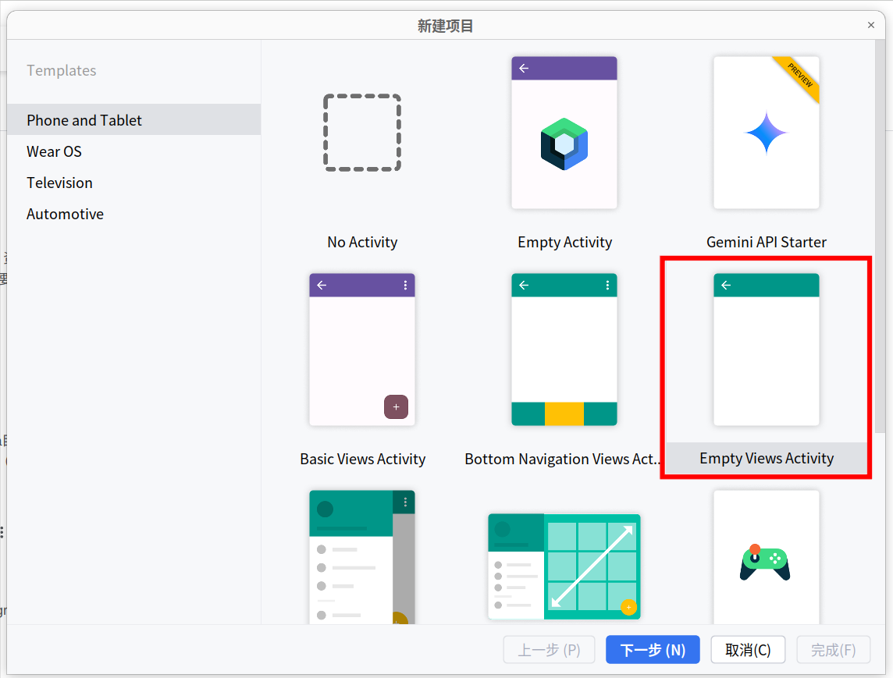
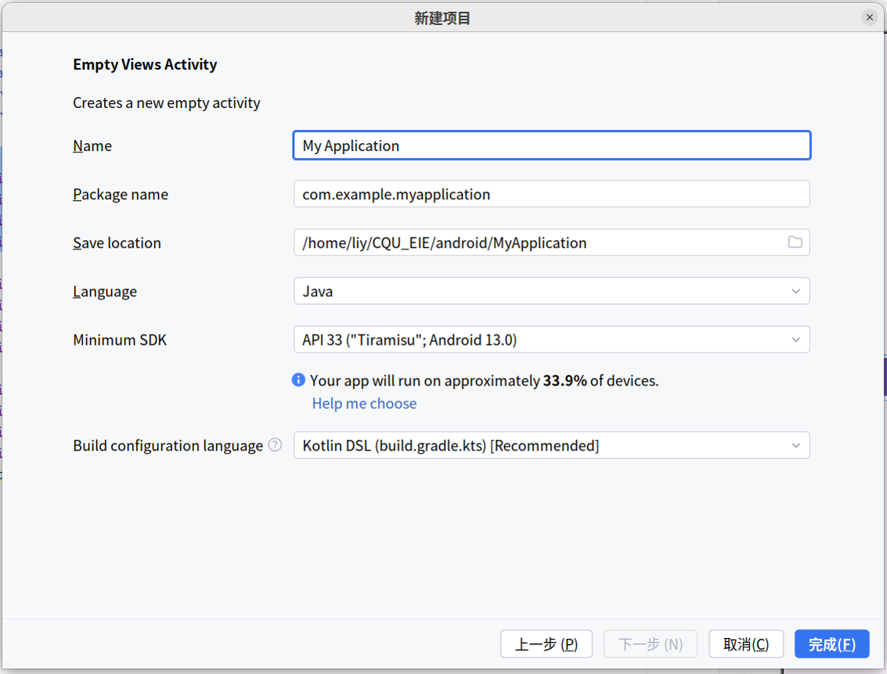
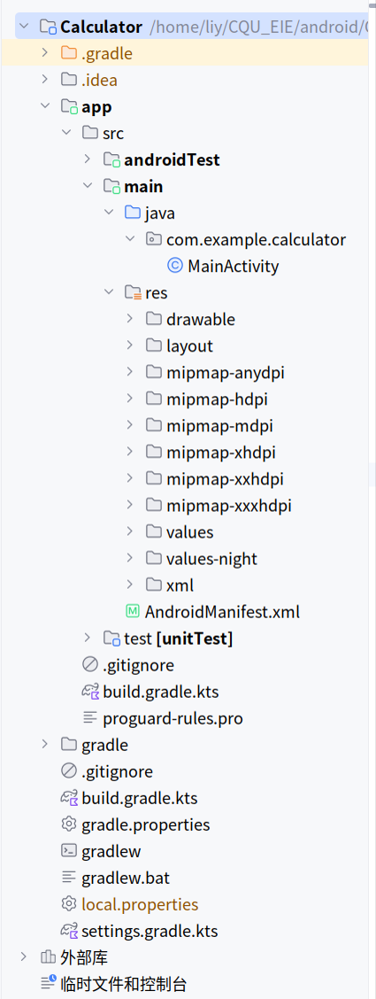

  
  <h1>
    智能座舱与人机交互 Android 开发
  </h1>

- 前情学习 1： [基本项目结构梳理](#基本项目结构梳理)

- 前请学习 2： [页面跳转](https://github.com/LeeYearn/CQU_EIE/tree/74740977bb3016a14fe1a97644140039688e51ff/android/PageSwitching)

- 课程任务 1： [计算器](https://github.com/LeeYearn/CQU_EIE/tree/ec6e32f3a544fa1fc9bf4c506d65b808d8c12d9d/android/Calculator)

<h2 id="基本项目结构梳理">基本项目结构梳理</h2>

### 1. 模板创建类型
- 一般选择 `Empty Views Activity`
  

- 进入具体设置后
  

  - `Name` 项目名称
  - `Package name` 默认即可
  - `Save lacation` 保存地点
  - `Language` 使用语言
  - `Minimum SDK` 最低SDK
  - `Build configuration language` 构建配置语言

### 2. 项目结构
  

